# 💰 Capital Financeiro

**Importe a fatura ou o extrato do banco em PDF e veja para onde o seu dinheiro foi.**
O PDF é lido **dentro do navegador** — ele nunca sai da sua máquina. O app extrai os
lançamentos, confere o total **contra o gabarito impresso no próprio PDF** e guarda só
as transações.

<p align="center">
  <a href="https://capital-financeiro.vercel.app"><strong>🔗 Abrir o app</strong></a> ·
  <a href="docs/ESTADO-ATUAL.md">Estado do projeto</a> ·
  <a href="#-arquitetura">Arquitetura</a> ·
  <a href="#-as-quatro-regras-que-fazem-a-conta-fechar">As regras que fazem a conta fechar</a>
</p>

<p align="center">
  
  
  
  
  
  
</p>

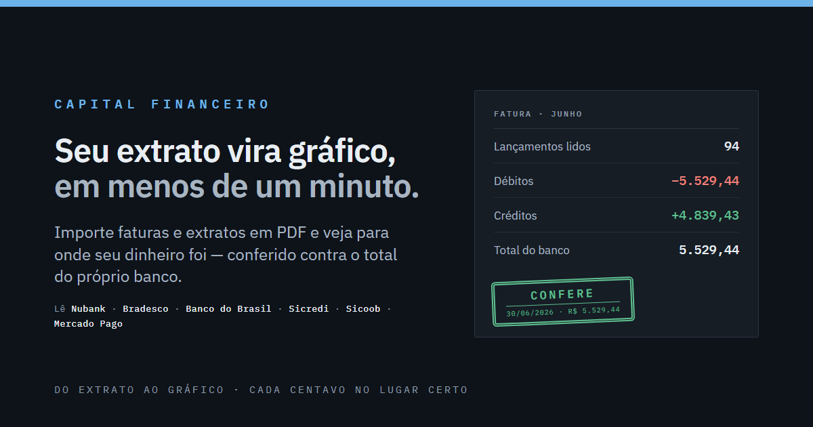

---

## 🖼️ Telas

A tela de acesso, nos dois temas — papel frio e tinta de livro-razão:

| Tema claro | Tema escuro |
|:---:|:---:|
| 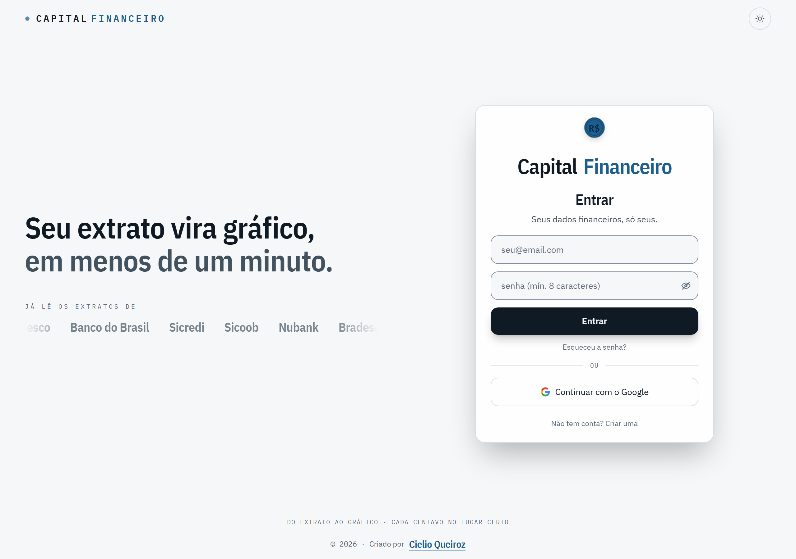 | 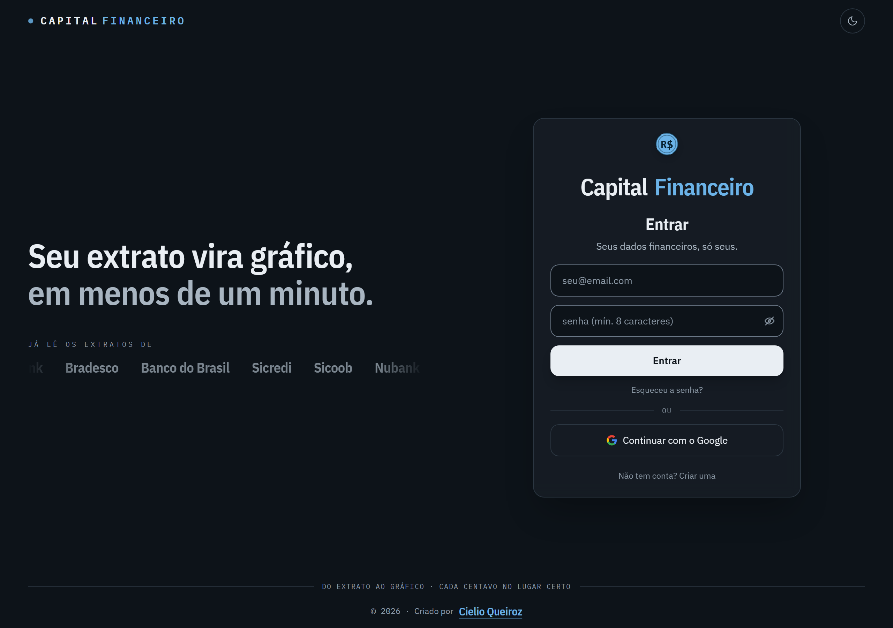 |

**O painel: em que o dinheiro foi, quando saiu, e como o mês se compara.**

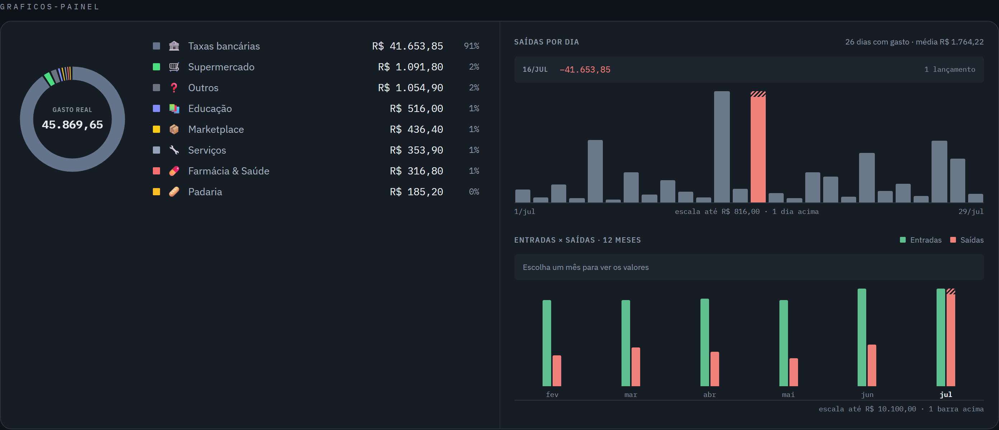

> Repare na barra branca e serrilhada do dia 16: um pagamento de empréstimo de
> R$ 41.653 num mês de compras de dezenas. A escala vai até o maior dia **não
> discrepante** (R$ 816) e declara o corte em vez de achatar os outros 25 dias
> contra o chão — que é o que uma escala pelo máximo faz.

**A fileira de saldos** — o que cada banco declara, sob um rótulo só:

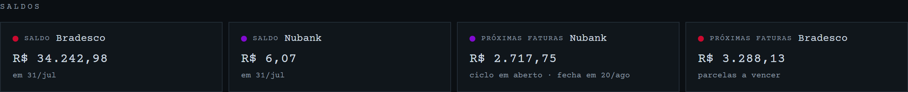

**O que já está comprado e ainda vem, por mês e por cartão** (roxo Nubank, vermelho
Bradesco — as cores institucionais, as mesmas em toda a tela):

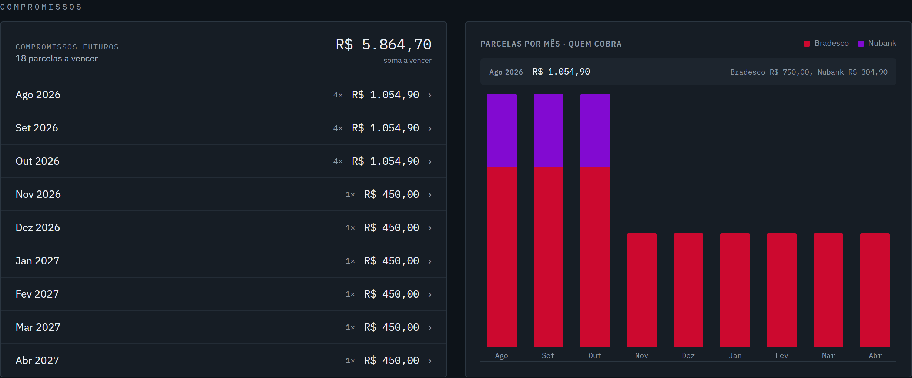

**Dois rankings que respondem perguntas diferentes** — e é a diferença que importa:

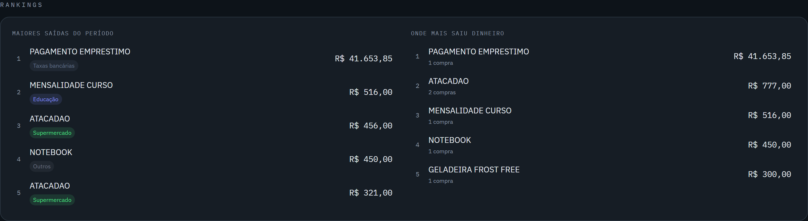

> Repare no **ATACADAO**: à esquerda ele aparece duas vezes, em 3º e 5º, como duas
> compras de R$ 456 e R$ 321. À direita, somado, ele sobe para **2º com R$ 777**. A
> lista da esquerda acha a compra única e grande; a da direita acha o ralo que só
> existe somado — e é justamente esse que passa despercebido.

> ### ⚠️ Nenhum número aqui é real
>
> Todas as imagens saem de `frontend/demo.html`, uma folha de provas com dados
> **fictícios** — saldos, compras, estabelecimentos e e-mail, todos inventados.
> **Nenhum extrato, valor ou dado pessoal real aparece neste repositório**, e é por
> desenho: PDFs reais são ignorados pelo git e os prints nunca são tirados do app
> com a conta de verdade. Regere com `python scripts/gerar-prints.py`.

---

## ✨ O que ele faz

| | |
|---|---|
| 📄 **Lê o PDF no navegador** | pdf.js em worker; o arquivo não é enviado a servidor nenhum |
| ✅ **Confere ao centavo** | cada parser valida o total lido contra o total declarado no PDF |
| 🏦 **5 bancos** | Nubank, Bradesco, Banco do Brasil, Sicredi e Sicoob (fatura e/ou extrato) |
| 🏷️ **Categoriza e aprende** | 30 categorias embutidas; corrigir uma compra ensina o app para as próximas |
| 🔗 **Não conta o mesmo dinheiro duas vezes** | cruza fatura × extrato e marca quitação e transferência entre contas próprias |
| 📅 **Dia / Semana / Mês / Ano** | Mês e Ano agrupam por **competência da fatura**; Dia e Semana, pela data da compra |
| 📊 **Gráficos próprios em SVG** | donut por categoria, saídas por dia, entradas × saídas, parcelas por mês |
| 🏪 **Onde mais saiu dinheiro** | ranking por estabelecimento, somando as compras repetidas — o gasto que nenhuma lista de "maior compra" mostra |
| 📈 **Compara com o período anterior** | "12% acima do mês passado" nos tiles; some quando não há base de comparação, em vez de inventar um "+100%" |
| 🔮 **Compromissos futuros** | projeta as parcelas que ainda vão cair, sem duplicar quando a fatura chegar |
| 🔁 **Recorrências e alertas** | detecta assinaturas pelo histórico e avisa quando o valor muda ou a cobrança some |
| 💵 **Saldo por conta e próximas faturas** | lidos do documento mais recente de cada banco |
| 📤 **Relatório em PDF** | gera o período em jsPDF e compartilha (celular) ou baixa (desktop) |
| 🔐 **Conta com RLS** | login e recuperação de senha via Neon Auth; cada usuário só enxerga as próprias linhas |
| 🌗 **Tema claro/escuro** | responsivo, do desktop largo ao celular |

---

## 🧭 Como funciona, em um diagrama

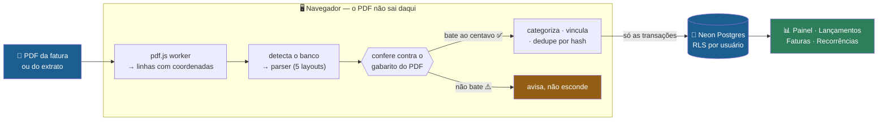

**O gabarito é o coração.** Todo banco imprime, na própria fatura, um total que ele
declara. O parser soma o que leu e compara. Se não bater, o app **diz que não bateu** —
nunca mostra um número que não fecha como se fechasse.

---

## 🧱 Arquitetura

Monorepo com npm workspaces. O domínio é **puro** — sem React, sem I/O — e é onde vivem
as regras que fazem o dinheiro fechar. É isso que permite testá-las sem navegador e sem
banco.

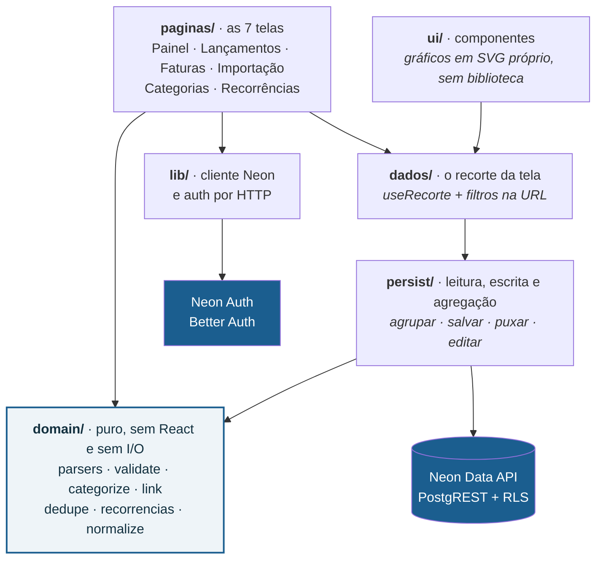

### Estrutura de pastas

```
capital-financeiro/
├── frontend/                    # o app React (workspace @capital/frontend)
│   ├── index.html               # entrada de produção (CSP, tema pré-pintura, OG)
│   ├── demo.html + src/demo.tsx # folha de provas: componentes com dados fictícios
│   ├── public/                  # fontes próprias (16 woff2), og.png, favicon
│   ├── tests/fixtures/          # PDFs anonimizados
│   └── src/
│       ├── domain/              # ⭐ regras puras (sem React, sem I/O)
│       │   ├── normalize/       # dinheiro em centavos, datas, parcelas, estabelecimento
│       │   ├── pdf/             # texto com coordenadas, linhas, detecção do banco
│       │   ├── parsers/         # Nubank, Bradesco, BB, Sicredi, Sicoob
│       │   ├── categorize/      # catálogo de 30 categorias, regras e aprendizado
│       │   ├── validate/        # conferência contra o gabarito do banco
│       │   ├── link/            # vínculos entre documentos (dupla contagem)
│       │   ├── dedupe/          # hash de documento e de transação
│       │   └── recorrencias.ts  # séries que se repetem + alertas
│       ├── persist/             # Data API + agregação de leitura
│       ├── dados/               # filtros na URL, recorte, provider do histórico
│       ├── ui/                  # componentes (gráficos em SVG próprio)
│       ├── paginas/             # as 7 telas
│       ├── i18n/                # pt / en / es
│       └── lib/                 # cliente Neon, auth por HTTP, perfil local
├── backend/
│   └── db/migrations/           # SQL versionado (schema + RLS)
├── scripts/                     # medidores e ferramentas (ver abaixo)
└── docs/                        # ESTADO-ATUAL.md, specs, planos, imagens
```

**Stack:** React 19 · TypeScript (strict) · Vite 7 · Tailwind v4 · Motion · sonner ·
pdf.js · jsPDF · Vitest · oxlint · Neon (Postgres + Data API + Auth) · Vercel.

---

## 🗄️ Modelo de dados

Cinco tabelas, **RLS desde o primeiro dia**. O cliente **nunca** envia `user_id`: ele
vem do `default (auth.user_id())` no servidor, então não há como um cliente adulterado
gravar linha no nome de outra pessoa.

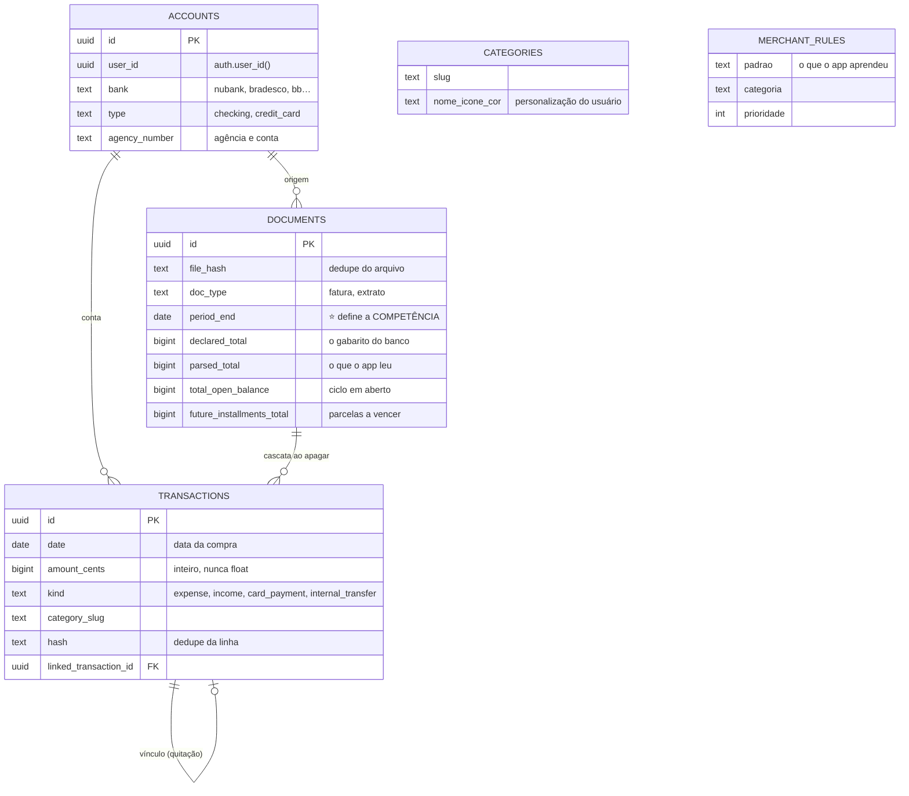

> 💵 **Dinheiro é `bigint` em centavos, nunca float.** `0.1 + 0.2 !== 0.3` em ponto
> flutuante, e um app cuja promessa é fechar ao centavo não pode começar perdendo
> centavos na soma.

---

## 🧠 As quatro regras que fazem a conta fechar

Quem for mexer no código precisa destas. São a diferença entre um número certo e um
número que mente com confiança:

1. **Fatura e extrato contam o mesmo dinheiro duas vezes.** Somar cru infla o gasto em
   ~2×. A fatura manda no detalhe; o pagamento dela, que aparece no extrato, é quitação
   (`card_payment`) e não despesa nova. → `domain/link/vinculos.ts`

2. **Mês = competência da fatura, não a data da compra.** Uma fatura cobre um ciclo que
   atravessa dois meses; agrupar pela data real partia a fatura ao meio (o supermercado
   de junho aparecia como R$ 287 em vez dos R$ 918 reais). A competência é o mês do
   `documents.period_end`. **Dia e Semana** seguem a data real, porque ali a pergunta é
   outra. → `persist/agrupar.ts`

3. **O PDF declara totais que servem de gabarito.** O parser se autoconfere contra eles.
   Nunca exiba um número que não bateu sem avisar. → `domain/validate/checksum.ts`

4. **Compromissos futuros nunca vão para o banco.** São calculados na hora, a partir da
   parcela mais recente de cada série — por isso não duplicam quando a próxima fatura é
   importada. → `persist/agrupar.ts::projecaoFutura`

---

## 🔐 Privacidade e segurança

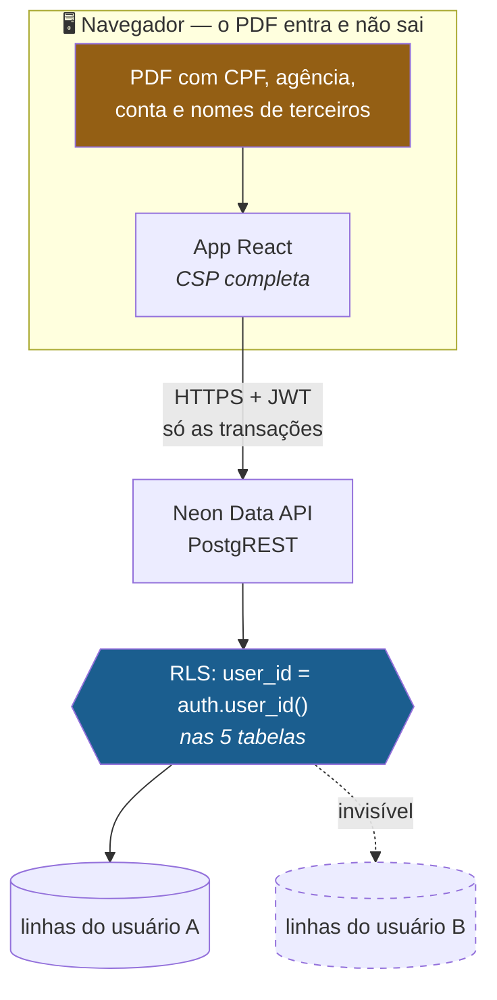

- **O PDF é lido no navegador** e nunca é enviado a lugar nenhum; só as transações
  extraídas são salvas.
- **PDFs reais são ignorados pelo git** (`*.pdf`): contêm CPF, agência, conta e nomes de
  terceiros, e o histórico do git é permanente. Os fixtures são **anonimizados**
  (`scripts/gerar-fixtures.ts`).
- **RLS nas cinco tabelas**, por `auth.user_id()`. O cliente nunca manda `user_id`.
- **CSP completa** (`vercel.json`), incluindo `script-src 'self'` + hash, `base-uri
  'none'` e `connect-src` com as **duas origens exatas** da Neon — um curinga
  `*.neon.tech` seria canal de exfiltração pronto, porque qualquer pessoa cria um
  projeto Neon e ganha um endpoint sob ele.
- **A política é medida, não opinada**: `scripts/medir-csp.py` sobe o build com os
  headers lidos do próprio `vercel.json` e dispara **16 sondas**, metade delas esperando
  **bloqueio** (script inline injetado, `eval`, imagem para fora, `<base>` externa…).
  Sem esses controles negativos, um header que nem chegou ao navegador daria zero
  violações e nota máxima.
- **As variáveis `VITE_*` são públicas por design** (vão para o bundle). A proteção real
  é o RLS + o JWT. **Nunca** ponha a string de conexão do Postgres num `VITE_`.
- **`npm audit` faz parte da revisão.** Em 13/08/2026 ele apontou uma falha **alta** no
  `pdfjs-dist` — *execução de JavaScript arbitrário ao abrir um PDF malicioso* —, que é
  a superfície mais exposta do app inteiro: abrir PDF é o que ele faz. Corrigida
  (5.7.284 → 6.2.108). O que **não** dá para corrigir daqui são as falhas da cadeia do
  SDK do Neon (`@neondatabase/neon-js` → `better-auth`): dependem de a Neon publicar
  versão nova, e os caminhos vulneráveis do `better-auth` são do **servidor de auth**
  hospedado por eles, não do cliente que vai no bundle.

> **Sobre o upgrade do pdf.js:** nenhum teste do projeto exercita o pdf.js de verdade
> (os fixtures são JSON já extraído, e `domain/pdf/load.ts` é mockado em jsdom, que não
> tem `DOMMatrix`). A suíte inteira passaria verde com o parser quebrado. Por isso o
> salto de major foi verificado gerando um PDF com texto conhecido e extraindo de volta
> pela mesma chamada que o app usa: texto e coordenadas idênticos nas duas versões.

---

## 🧪 Qualidade — o que roda antes de dizer "pronto"

```bash
npm test && npm run build && npm run lint    # os três, sempre
python scripts/medir-csp.py                  # DEPOIS do build
python scripts/medir-contraste.py            # WCAG de todos os pares em uso
python scripts/medir-overflow.py             # rolagem lateral, 1280×800 e 390×844
```

> ⚠️ **`npm test` não checa tipos.** Verde no Vitest não é verde — quem pega erro de
> tipo é o `tsc -b` do `npm run build`. Esta armadilha já mordeu três vezes neste
> projeto.

| Ferramenta | O que ela reprova |
|---|---|
| **604 testes** (78 arquivos) | regra de negócio, componente e contrato de HTTP |
| `medir-csp.py` | política que quebra o app **ou** que não bloqueia o que promete |
| `medir-contraste.py` | par de cores abaixo de AA — já achou 6, corrigidos por busca preservando matiz |
| `medir-overflow.py` | rolagem lateral no desktop e no celular |
| `gerar-prints.py` | (não reprova) regera as imagens deste README |
| `diagnostico.ts` | roda o pipeline real nos seus PDFs e imprime o total por categoria |

**Método:** TDD. E a lição mais cara registrada aqui é **teste que passa dos dois
jeitos é pior que nenhum** — mais de um defeito sobreviveu a uma suíte verde porque a
asserção era fraca demais para notar a diferença. Correções importantes são verificadas
**por mutação**: quebra-se a implementação de propósito e confere-se que o teste cai.

---

## 🚀 Como rodar

```bash
npm install
npm run dev            # http://localhost:5173
```

Sem variáveis de ambiente o app roda em **modo "importa e vê"**: lê o PDF e mostra os
gráficos, sem login e sem salvar nada. Para persistir, crie um `.env.local` **na raiz**
(não em `frontend/` — o Vite está com `envDir: '..'`):

```bash
VITE_NEON_DATA_API_URL=https://<endpoint>.apirest.<região>.aws.neon.tech/neondb/rest/v1
VITE_NEON_AUTH_URL=https://<endpoint>.neonauth.<região>.aws.neon.tech/neondb/auth
```

Depois aplique as migrações de `backend/db/migrations/` no SQL Editor do Neon, na ordem.

Outros comandos:

```bash
npm run build                              # tsc -b + build de produção
npm test                                   # Vitest
npm run lint                               # oxlint
npm run fixtures -- <pasta-com-os-pdfs>    # regenera fixtures anonimizados
npx tsx scripts/diagnostico.ts <pasta>     # diagnóstico nos seus PDFs
python scripts/gerar-prints.py             # prints deste README (com o dev no ar)
```

---

## 🎨 A direção visual: "livro-razão"

O visual anterior — creme, serifada de alto contraste, âmbar, cantos de 16px, brilho e
grão — era o cluster nº 1 do que hoje se reconhece de longe como **página gerada por
IA**. A direção atual sai do que o app **faz**: ele confere, ao centavo, contra o
gabarito do banco. Isso é conciliação contábil, e o desenho vem desse mundo.

- **Papel frio** de formulário fiscal (`#f6f7f9`), tinta azul-ferro, marca azul de
  carimbo (`#1b5e8f`)
- **Semântica crédito/débito** — nunca cor sozinha: sempre com sinal ou rótulo
- **Cantos de 2–3px**, réguas de 1px, zero gradiente
- **Uma família, três vozes** (IBM Plex): Mono nos números — que são o herói da tela —,
  Condensed nos rótulos de coluna, Sans no corpo. Servida do **próprio domínio** (16
  woff2, 412 kB), o que foi o que destravou a CSP `font-src 'self'`
- **Gráficos em SVG próprio, sem biblioteca**: gráfico com cara de biblioteca é
  justamente a cara que se pediu para evitar — e a cor do donut segue a **categoria**,
  não o ranking, então trocar de mês não repinta o que sobrou

### Uma decisão de gráfico que vale contar

Um pagamento de empréstimo de R$ 41.653 num mês de compras de dezenas achatava as outras
25 barras contra o chão. Escala logarítmica resolveria o aperto e **cobraria caro**: as
alturas deixariam de ser comparáveis em silêncio, e ninguém desconfia de um gráfico
bonito. A saída foi escala linear até um **teto robusto** (cerca de Tukey, `q3 +
1,5·IQR`), com quem passa dele desenhado **cortado** — serrilha à vista, valor cheio no
nome acessível e o aviso "escala até R$ 816 · 1 dia acima" embaixo. A distorção existe,
é local, e está declarada. → `ui/escala-barras.ts`

---

## 📌 Estado e o que falta

Funcionando ponta a ponta contra o Neon real: importação, conferência ao centavo,
categorização com aprendizado, vínculos, persistência, login, recuperação de senha,
confirmação de e-mail por código, as sete páginas, filtros na URL, gráficos, recorrências,
compromissos futuros, tutorial e relatório em PDF.

Aberto hoje:

- **Backend próprio** (Vercel Functions) — desenhado, esperando a `DATABASE_URL` de uma
  role sem `BYPASSRLS`. Enquanto isso o cliente fala direto com a Data API, com RLS.
- **SDK do Neon em beta** (`@neondatabase/neon-js@0.6.2-beta`) — já existe a `0.7.0-beta`,
  e o `npm audit` aponta a cadeia dele. O upgrade está **parado de propósito**: a suíte
  mocka o SDK inteiro, então uma regressão de login não seria pega por teste nenhum —
  validar exige entrar com uma conta real.
- **Mais bancos** — Caixa parada por falta de amostra (o extrato veio como imagem e o
  app lê texto) e o layout A do BB (2020) espera um PDF nesse formato aparecer.
- **Confirmação de e-mail por link** — o Neon Auth com remetente compartilhado só envia
  **código**; link exige provedor de e-mail próprio. O app se ajustou ao que de fato
  chega na caixa de entrada.

O histórico completo, com o porquê de cada decisão, está em
[`docs/ESTADO-ATUAL.md`](docs/ESTADO-ATUAL.md) — é o arquivo para ler antes de retomar
o trabalho.

---

## 👤 Autor

**Cielio Queiroz** — [portfólio](https://cielio-portfolio.vercel.app/)

## 📄 Licença

Projeto de uso livre para fins pessoais e de estudo.
